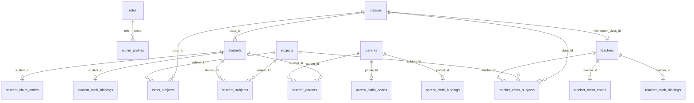

# Hamrash Supabase Database Schema

This document describes every table in the `public` schema, how they relate to each other, and what happens when a row is deleted. It was generated from the live Supabase project via MCP (`list_tables` + foreign-key introspection).

All 19 tables have **Row Level Security (RLS) enabled**.

---

## How to read this document

- **Belongs to** — this table holds a foreign key pointing at another table.
- **Has many / Has one** — other tables reference this one.
- **CASCADE** — deleting the parent row automatically deletes dependent rows.
- **SET NULL** — deleting the parent row clears the foreign-key column on dependents; the dependent row stays.
- **No FK** — the column exists as plain text with no database-enforced link.

---

## High-level architecture

Hamrash is a school management system. The schema splits naturally into five areas:

1. **Admin & auth** — who can use the admin app (`roles`, `admin_profiles`)
2. **School structure** — classes, subjects, and how they combine (`classes`, `subjects`, `class_subjects`, plus lookup tables)
3. **Teachers** — staff profiles, assignments, and Clerk onboarding
4. **Students** — learner profiles, class enrollment, subject enrollment, and Clerk onboarding
5. **Parents & family** — guardians linked to students through a junction table

External identity is handled by **Clerk** (`clerk_id` columns). Those are not Postgres foreign keys, but they matter when deleting a person — you may also want to revoke their Clerk account separately.



---

## 1. Admin & authentication

### `roles`

**Purpose:** Canonical list of admin role names used for authorization in the admin app.

| Column | Notes |
|--------|-------|
| `id` | UUID primary key |
| `name` | Unique. Allowed values: `super_admin`, `admin`, `vice_principal`, `principal` |
| `description` | Optional human-readable label |

**Relationships**

| Direction | Table | Via |
|-----------|-------|-----|
| Referenced by | `admin_profiles` | `admin_profiles.role` → `roles.name` |

**If you delete a role**

| Effect | Detail |
|--------|--------|
| `admin_profiles.role` → **SET NULL** | Admins with that role keep their profile, but `role` becomes `null`. They may lose permissions until reassigned. |
| Nothing else | No other tables reference `roles`. |

---

### `admin_profiles`

**Purpose:** One row per admin user in the Hamrash admin app. `clerk_id` maps to the Clerk JWT `sub` claim.

| Column | Notes |
|--------|-------|
| `clerk_id` | Unique link to Clerk (external, not a DB FK) |
| `role` | FK to `roles.name`, defaults to `'admin'` |
| `full_name`, `email`, `phone_number`, `gender`, `avatar_url`, `address`, `state` | Profile fields |
| `is_active`, `last_login_at` | Account status |

**Relationships**

| Direction | Table | Via |
|-----------|-------|-----|
| Belongs to | `roles` | `role` → `roles.name` |

**If you delete an admin profile**

| Effect | Detail |
|--------|--------|
| No cascade | Nothing else in the database references `admin_profiles`. |
| Clerk account | Still exists in Clerk unless you delete/revoke it there separately. |

---

## 2. School structure

### `states`

**Purpose:** Lookup table for Nigerian states (`id`, `name`).

**Relationships:** None at the database level.

**If you delete a state**

| Effect | Detail |
|--------|--------|
| No DB impact | `students.state`, `teachers.state`, `parents.state`, and `admin_profiles.state` are **plain text**, not foreign keys. Deleting a `states` row does not update or block those records. |

> **Design note:** Consider adding a FK from person tables to `states.id` if you want referential integrity.

---

### `sections`

**Purpose:** Lookup table for class sections (e.g. A, B, C).

**Relationships:** None at the database level.

**If you delete a section**

| Effect | Detail |
|--------|--------|
| No DB impact | `classes.section` is **plain text**, not a FK to this table. |

---

### `classes`

**Purpose:** A school class (e.g. "JSS 1"). Holds `name`, optional `section` text, and an `is_active` flag.

**Relationships**

| Direction | Table | Via | On delete |
|-----------|-------|-----|-----------|
| Has many | `students` | `students.class_id` | SET NULL |
| Has many | `class_subjects` | `class_subjects.class_id` | CASCADE |
| Has many | `teacher_class_subjects` | `teacher_class_subjects.class_id` | CASCADE |
| Has one (optional) | `teachers` (homeroom) | `teachers.homeroom_class_id` | SET NULL |

**If you delete a class**

| Effect | Detail |
|--------|--------|
| `class_subjects` rows | **Deleted** (CASCADE) — subject assignments for this class are removed |
| `teacher_class_subjects` rows | **Deleted** (CASCADE) — teacher teaching assignments for this class are removed |
| `students.class_id` | **Set to NULL** — students remain in the system but are unassigned from any class |
| `teachers.homeroom_class_id` | **Set to NULL** — homeroom teachers lose their homeroom link but stay in the system |

---

### `subjects`

**Purpose:** Subject catalog (e.g. Mathematics, English). Each subject has `name`, optional `description`, and `is_active`.

**Relationships**

| Direction | Table | Via | On delete |
|-----------|-------|-----|-----------|
| Has many | `class_subjects` | `class_subjects.subject_id` | CASCADE |
| Has many | `teacher_class_subjects` | `teacher_class_subjects.subject_id` | CASCADE |
| Has many | `student_subjects` | `student_subjects.subject_id` | CASCADE |

**If you delete a subject**

| Effect | Detail |
|--------|--------|
| `class_subjects` rows | **Deleted** — subject removed from all classes |
| `teacher_class_subjects` rows | **Deleted** — teachers lose assignments for this subject |
| `student_subjects` rows | **Deleted** — students lose enrollment in this subject |

---

### `class_subjects`

**Purpose:** Junction table — defines which subjects are part of a class curriculum.

| Column | Notes |
|--------|-------|
| `class_id` | FK → `classes.id` (CASCADE on delete) |
| `subject_id` | FK → `subjects.id` (CASCADE on delete) |

**If you delete a `class_subjects` row**

| Effect | Detail |
|--------|--------|
| Isolated | Only that class–subject link is removed. Classes, subjects, teachers, and students are untouched. |

**If the parent class or subject is deleted**

| Effect | Detail |
|--------|--------|
| This row is deleted | CASCADE from either side. |

---

## 3. Teachers

### `teachers`

**Purpose:** Teacher/staff profile. Can optionally be assigned as a homeroom teacher (`homeroom_class_id`, `homeroom_role`).

**Relationships**

| Direction | Table | Via | On delete |
|-----------|-------|-----|-----------|
| Belongs to (optional) | `classes` | `homeroom_class_id` | SET NULL (when class deleted) |
| Has one | `teacher_claim_codes` | `teacher_id` (PK) | CASCADE (when teacher deleted) |
| Has one | `teacher_clerk_bindings` | `teacher_id` (PK) | CASCADE (when teacher deleted) |
| Has many | `teacher_class_subjects` | `teacher_id` | CASCADE (when teacher deleted) |

**If you delete a teacher**

| Effect | Detail |
|--------|--------|
| `teacher_claim_codes` | **Deleted** — onboarding code is gone |
| `teacher_clerk_bindings` | **Deleted** — Clerk link removed from DB (Clerk user may still exist externally) |
| `teacher_class_subjects` | **Deleted** — all class/subject teaching assignments removed |
| `classes` | Unchanged — homeroom reference was on the teacher side, so deleting the teacher does not affect the class row |

---

### `teacher_class_subjects`

**Purpose:** Three-way assignment — which teacher teaches which subject in which class.

| Column | Notes |
|--------|-------|
| `teacher_id` | FK → `teachers.id` (CASCADE) |
| `class_id` | FK → `classes.id` (CASCADE) |
| `subject_id` | FK → `subjects.id` (CASCADE) |

**If you delete this row:** Only that specific assignment is removed.

**If you delete a teacher, class, or subject:** Matching assignment rows are **CASCADE deleted**.

---

### `teacher_claim_codes`

**Purpose:** One-time code a teacher uses to claim their account in the teacher app. `teacher_id` is the primary key (strict 1:1).

**If you delete a claim code row:** The teacher profile remains; they would need a new code to onboard.

**If you delete the teacher:** This row is **CASCADE deleted**.

---

### `teacher_clerk_bindings`

**Purpose:** Links a teacher record to a Clerk user after they complete onboarding. `teacher_id` is the primary key (strict 1:1).

**If you delete a binding:** Teacher profile remains; they lose app login until rebound.

**If you delete the teacher:** This row is **CASCADE deleted**.

---

## 4. Students

### `students`

**Purpose:** Student profile — personal info, admission details, optional class enrollment, and app tokens.

**Relationships**

| Direction | Table | Via | On delete |
|-----------|-------|-----|-----------|
| Belongs to (optional) | `classes` | `class_id` | SET NULL (when class deleted) |
| Has one | `student_claim_codes` | `student_id` (unique) | CASCADE (when student deleted) |
| Has one | `student_clerk_bindings` | `student_id` (PK) | CASCADE (when student deleted) |
| Has many | `student_parents` | `student_id` | CASCADE (when student deleted) |
| Has many | `student_subjects` | `student_id` | CASCADE (when student deleted) |

**If you delete a student**

| Effect | Detail |
|--------|--------|
| `student_claim_codes` | **Deleted** |
| `student_clerk_bindings` | **Deleted** |
| `student_parents` | **Deleted** — links to parents are removed, but **parent rows themselves are kept** |
| `student_subjects` | **Deleted** — subject enrollments removed |
| `parents` | **Unchanged** — a parent linked only to this student remains in the system |

---

### `student_subjects`

**Purpose:** Junction table — subjects a student is enrolled in (may differ from the full class curriculum).

**If you delete this row:** Only that enrollment is removed.

**If you delete the student or subject:** Matching rows are **CASCADE deleted**.

---

### `student_claim_codes`

**Purpose:** One-time onboarding code for the student app. One code per student (`student_id` is unique).

**If you delete the student:** Row is **CASCADE deleted**.

---

### `student_clerk_bindings`

**Purpose:** Links a student to their Clerk account after claim. `student_id` is the primary key (strict 1:1).

**If you delete the student:** Row is **CASCADE deleted**.

---

## 5. Parents & family

### `parents`

**Purpose:** Parent or guardian profile — contact info and app tokens.

**Relationships**

| Direction | Table | Via | On delete |
|-----------|-------|-----|-----------|
| Has one | `parent_claim_codes` | `parent_id` (unique) | CASCADE (when parent deleted) |
| Has one | `parent_clerk_bindings` | `parent_id` (PK) | CASCADE (when parent deleted) |
| Has many | `student_parents` | `parent_id` | CASCADE (when parent deleted) |

**If you delete a parent**

| Effect | Detail |
|--------|--------|
| `parent_claim_codes` | **Deleted** |
| `parent_clerk_bindings` | **Deleted** |
| `student_parents` | **Deleted** — links to students are removed, but **student rows themselves are kept** |
| `students` | **Unchanged** |

---

### `student_parents`

**Purpose:** Junction table linking students to parents/guardians.

| Column | Notes |
|--------|-------|
| `student_id` | FK → `students.id` (CASCADE) |
| `parent_id` | FK → `parents.id` (CASCADE) |
| `relationship` | `mother`, `father`, `guardian`, or `other` |
| `is_primary` | Whether this is the primary contact |

**If you delete this row:** Only that family link is removed.

**If you delete a student:** Matching links are **CASCADE deleted**; parents remain.

**If you delete a parent:** Matching links are **CASCADE deleted**; students remain.

---

### `parent_claim_codes`

**Purpose:** One-time onboarding code for the parent app. One code per parent (`parent_id` is unique).

**If you delete the parent:** Row is **CASCADE deleted**.

---

### `parent_clerk_bindings`

**Purpose:** Links a parent to their Clerk account. `parent_id` is the primary key (strict 1:1).

**If you delete the parent:** Row is **CASCADE deleted**.

---

## Delete impact quick reference

What happens when you delete **one row** from each table:

| Delete this… | CASCADE deletes (children removed) | SET NULL (children kept, FK cleared) | Unaffected |
|--------------|-------------------------------------|--------------------------------------|------------|
| **`roles`** | — | `admin_profiles.role` | Everything else |
| **`admin_profiles`** | — | — | Everything (no dependents) |
| **`states`** | — | — | Everything (no FKs; text fields unchanged) |
| **`sections`** | — | — | Everything (no FKs; text fields unchanged) |
| **`classes`** | `class_subjects`, `teacher_class_subjects` | `students.class_id`, `teachers.homeroom_class_id` | Subjects, teachers, students (rows kept) |
| **`subjects`** | `class_subjects`, `teacher_class_subjects`, `student_subjects` | — | Classes, teachers, students |
| **`class_subjects`** | — | — | Classes & subjects (only the link row goes) |
| **`teachers`** | `teacher_claim_codes`, `teacher_clerk_bindings`, `teacher_class_subjects` | — | Classes, students, parents |
| **`teacher_class_subjects`** | — | — | Teacher, class, subject (only the link row goes) |
| **`teacher_claim_codes`** | — | — | Teacher profile |
| **`teacher_clerk_bindings`** | — | — | Teacher profile |
| **`students`** | `student_claim_codes`, `student_clerk_bindings`, `student_parents`, `student_subjects` | — | Parents, classes, subjects |
| **`student_subjects`** | — | — | Student & subject |
| **`student_claim_codes`** | — | — | Student profile |
| **`student_clerk_bindings`** | — | — | Student profile |
| **`parents`** | `parent_claim_codes`, `parent_clerk_bindings`, `student_parents` | — | Students, classes, subjects |
| **`student_parents`** | — | — | Student & parent |
| **`parent_claim_codes`** | — | — | Parent profile |
| **`parent_clerk_bindings`** | — | — | Parent profile |

---

## Cascade chains (multi-hop deletes)

Some deletes trigger a chain reaction:

### Delete a **class**
```
classes
  ├─ CASCADE → class_subjects (all curriculum links for this class)
  ├─ CASCADE → teacher_class_subjects (all teacher assignments for this class)
  ├─ SET NULL → students.class_id (students become unassigned)
  └─ SET NULL → teachers.homeroom_class_id (homeroom cleared)
```

### Delete a **subject**
```
subjects
  ├─ CASCADE → class_subjects
  ├─ CASCADE → teacher_class_subjects
  └─ CASCADE → student_subjects
```

### Delete a **teacher**
```
teachers
  ├─ CASCADE → teacher_claim_codes
  ├─ CASCADE → teacher_clerk_bindings
  └─ CASCADE → teacher_class_subjects
```

### Delete a **student**
```
students
  ├─ CASCADE → student_claim_codes
  ├─ CASCADE → student_clerk_bindings
  ├─ CASCADE → student_parents (parent rows survive)
  └─ CASCADE → student_subjects
```

### Delete a **parent**
```
parents
  ├─ CASCADE → parent_claim_codes
  ├─ CASCADE → parent_clerk_bindings
  └─ CASCADE → student_parents (student rows survive)
```

---

## Soft delete vs hard delete

Several tables expose an `is_active` flag (`admin_profiles`, `classes`, `subjects`, `teachers`, `students`, `parents`). Prefer setting `is_active = false` when you want to hide someone or something without triggering cascades.

Hard deletes are appropriate when you truly want to remove onboarding codes, Clerk bindings, and junction rows — the schema is designed so person deletes clean up their satellite tables automatically.

---

## Known gaps (no foreign key enforced)

| Column | Current type | Ideal link |
|--------|--------------|------------|
| `students.state`, `teachers.state`, `parents.state`, `admin_profiles.state` | `text` | `states.id` or `states.name` |
| `classes.section` | `text` | `sections.id` or `sections.name` |
| `*_clerk_bindings.clerk_id`, `admin_profiles.clerk_id` | `text` | External Clerk user (not in Postgres) |

These gaps mean deleting lookup rows (`states`, `sections`) or Clerk users has **no automatic effect** on related person/class records.

---

## All foreign keys (source of truth)

| Constraint | From | To | ON DELETE |
|------------|------|----|-----------|
| `admin_profiles_role_fkey` | `admin_profiles.role` | `roles.name` | SET NULL |
| `students_class_id_fkey` | `students.class_id` | `classes.id` | SET NULL |
| `class_subjects_class_id_fkey` | `class_subjects.class_id` | `classes.id` | CASCADE |
| `teacher_class_subjects_class_id_fkey` | `teacher_class_subjects.class_id` | `classes.id` | CASCADE |
| `teachers_homeroom_class_id_fkey` | `teachers.homeroom_class_id` | `classes.id` | SET NULL |
| `class_subjects_subject_id_fkey` | `class_subjects.subject_id` | `subjects.id` | CASCADE |
| `student_subjects_subject_id_fkey` | `student_subjects.subject_id` | `subjects.id` | CASCADE |
| `teacher_class_subjects_subject_id_fkey` | `teacher_class_subjects.subject_id` | `subjects.id` | CASCADE |
| `teacher_claim_codes_teacher_id_fkey` | `teacher_claim_codes.teacher_id` | `teachers.id` | CASCADE |
| `teacher_clerk_bindings_teacher_id_fkey` | `teacher_clerk_bindings.teacher_id` | `teachers.id` | CASCADE |
| `teacher_class_subjects_teacher_id_fkey` | `teacher_class_subjects.teacher_id` | `teachers.id` | CASCADE |
| `student_claim_codes_student_id_fkey` | `student_claim_codes.student_id` | `students.id` | CASCADE |
| `student_clerk_bindings_student_id_fkey` | `student_clerk_bindings.student_id` | `students.id` | CASCADE |
| `student_parents_student_id_fkey` | `student_parents.student_id` | `students.id` | CASCADE |
| `student_subjects_student_id_fkey` | `student_subjects.student_id` | `students.id` | CASCADE |
| `parent_claim_codes_parent_id_fkey` | `parent_claim_codes.parent_id` | `parents.id` | CASCADE |
| `parent_clerk_bindings_parent_id_fkey` | `parent_clerk_bindings.parent_id` | `parents.id` | CASCADE |
| `student_parents_parent_id_fkey` | `student_parents.parent_id` | `parents.id` | CASCADE |

---

*Last introspected from Supabase via MCP.*
